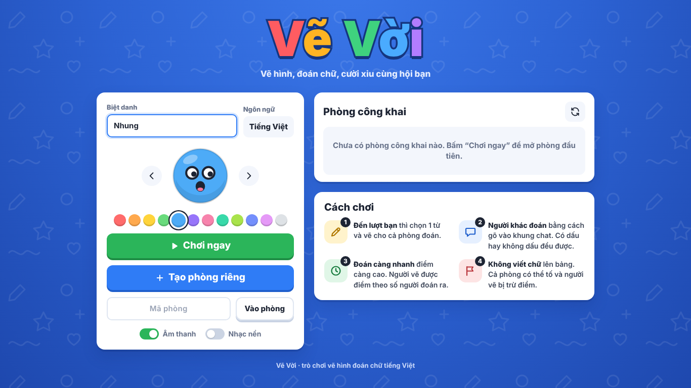
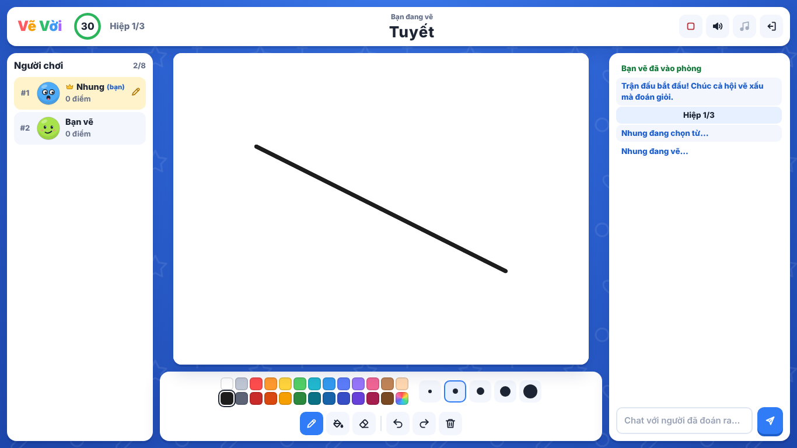

# Vẽ Vời: vẽ hình đoán chữ tiếng Việt

Game vẽ hình đoán chữ nhiều người chơi (2 đến 12 người), chạy trên trình duyệt máy tính, máy tính bảng và điện thoại.
Lối chơi lấy [skribbl.io](https://skribbl.io) làm chuẩn tham chiếu nhưng giao diện, logo, avatar, âm thanh và mã nguồn đều tự làm,
và được tối ưu cho tiếng Việt: gõ có dấu hay không dấu đều đoán được, ngân hàng 463 từ theo 13 chủ đề.

- **Không cần cài thư viện nào.** Chỉ cần Node.js. Máy chủ WebSocket, kiểm tra dữ liệu, giới hạn tần suất đều tự viết bằng Node thuần.
- **Máy chủ quyết định mọi thứ:** người vẽ, từ khoá, đồng hồ, điểm, ai đoán đúng. Trình duyệt chỉ gửi ý định và hiển thị.
- **Từ khoá không bao giờ bị gửi tới người đang đoán**, kể cả trong dữ liệu mạng.

| Trang chủ | Đang vẽ |
|---|---|
|  |  |

---

## Mục lục

1. [Yêu cầu](#1-yêu-cầu)
2. [Cài đặt](#2-cài-đặt)
3. [Chạy khi phát triển](#3-chạy-khi-phát-triển)
4. [Build](#4-build)
5. [Kiểm thử](#5-kiểm-thử)
6. [Chạy production](#6-chạy-production)
7. [Biến môi trường](#7-biến-môi-trường)
8. [Triển khai](#8-triển-khai)
9. [Kiến trúc](#9-kiến-trúc)
10. [Luật chơi & tính năng](#10-luật-chơi--tính-năng)
11. [Xử lý sự cố](#11-xử-lý-sự-cố)
12. [Giấy phép](#12-giấy-phép)

---

## 1. Yêu cầu

| Thành phần | Phiên bản |
|---|---|
| Node.js | **18 trở lên** (khuyên dùng 20 hoặc 22 LTS). `npm run dev` cần 18.11+. |
| Trình duyệt người chơi | Chrome/Edge 105+, Firefox 110+, Safari 16+ (iOS 16+). Cần hỗ trợ container queries và `<dialog>`. |
| Mạng | Máy chủ và người chơi cùng mạng (Wi-Fi/LAN), hoặc máy chủ có địa chỉ công khai (xem [Triển khai](#8-triển-khai)). |
| Kiểm thử giao diện (tuỳ chọn) | Python 3.9+ và Playwright: `pip install playwright` rồi `python -m playwright install chromium`. |

Font chữ (Nunito, Baloo 2) tải từ Google Fonts. Máy không có Internet thì trình duyệt dùng font có sẵn, game vẫn chạy bình thường.

## 2. Cài đặt

```bash
cd ve-voi
npm install        # không tải gói nào (dự án không có dependency), chỉ tạo/kiểm tra package-lock.json
```

**Windows, cách nhanh nhất:** bấm đúp **`Chay-game.bat`**. File này kiểm tra Node.js (thiếu hoặc quá cũ thì mở trang tải về),
bật máy chủ và tự mở trình duyệt. Giữ cửa sổ đen mở trong lúc chơi; đóng nó là tắt game.

## 3. Chạy khi phát triển

```bash
npm run dev        # node --watch: sửa code máy chủ là tự khởi động lại
# hoặc
npm start          # chạy bình thường
```

Mở **http://localhost:3000**. Cửa sổ máy chủ in sẵn địa chỉ để bạn bè cùng Wi-Fi vào, dạng `http://192.168.x.x:3000`.
Lần đầu chạy, Windows có thể hỏi cho phép Node.js qua tường lửa: tích **Private networks** rồi chọn **Allow access**.

Giao diện là file tĩnh trong `public/` (ES module, không cần đóng gói). Sửa xong chỉ cần tải lại trang.

Muốn thử nhanh một trận mà không phải chờ: `TIME_SCALE=0.3 npm start` (mọi thời lượng nhân 0,3; PowerShell: `$env:TIME_SCALE=0.3; npm start`).

## 4. Build

```bash
npm run build
```

Game chạy thẳng mã nguồn nên không có bước đóng gói. `npm run build` (file `scripts/check.js`) **kiểm tra toàn bộ dự án** trước khi chạy hoặc triển khai, lỗi thì dừng với mã 1:

- cú pháp mọi file JS (máy chủ CommonJS, giao diện ES module, test, script);
- ký tự vô hình hoặc đảo chiều chữ lọt vào mã nguồn;
- `import` giữa các module giao diện trỏ đúng file và đúng tên được `export`;
- `index.html`: tài nguyên tồn tại, không có script nội tuyến (CSP sẽ chặn), mọi `#id` và biểu tượng mà JS dùng đều có thật;
- mọi module máy chủ nạp được; ngân hàng từ không trùng, không có từ sai định dạng; không lỡ thêm dependency.

## 5. Kiểm thử

```bash
npm test                    # 83 test: đơn vị + tích hợp qua WebSocket thật (khoảng 45 giây)
npm run test:unit           # chỉ test đơn vị (vài giây)
npm run test:integration    # chỉ test tích hợp
npm test -- canvas          # chỉ chạy file có tên chứa "canvas"
npm run check               # build + toàn bộ test
```

Test dùng `node:test` có sẵn trong Node. Test tích hợp bật máy chủ thật trên cổng ngẫu nhiên, mỗi người chơi là một kết nối WebSocket riêng,
thời lượng game rút ngắn bằng hệ số thời gian.

| File | Nội dung |
|---|---|
| `test/vietnamese.test.js` | chuẩn hoá Unicode, so khớp có/không dấu, chống nhầm (`bò` ≠ `bơ`), lượng từ, Levenshtein, câu chứa đáp án, mặt nạ |
| `test/rules.test.js` | điểm, ngân hàng từ, chọn từ, gợi ý, kiểm tra cài đặt & hồ sơ, giao thức, giới hạn tần suất, bảng vẽ |
| `test/engine.test.js` | máy trạng thái, xoay vòng người vẽ, giữ bí mật từ, kênh chat, chống spam, tắt chat, tố cáo, thích/chưa thích, bỏ phiếu, quyền chủ phòng |
| `test/multiplayer.test.js` | trận đầy đủ 3 người × 2 hiệp (quét mọi gói tin để chắc chắn không lộ từ), chơi lại, về phòng chờ, hết giờ, tự chọn từ, kết quả đoán, chơi nhanh, lỗi nội bộ |
| `test/canvas.test.js` | 100 nét tới đúng thứ tự, người vào giữa lượt nhận cả nét đang vẽ dở, tải lại trang, hoàn tác/làm lại/xoá, chặn người không phải người vẽ, kẹp toạ độ |
| `test/resilience.test.js` | tải lại trang, mở tab thứ hai, người đoán / người vẽ / chủ phòng rớt mạng, còn 1 người, phòng hết hạn |
| `test/moderation.test.js` | mời ra (có thời gian chờ), cấm, tắt chat, bỏ phiếu, quyền chủ phòng, đồng bộ cài đặt, phòng đầy, mật khẩu |
| `test/security.test.js` | payload sai, tên sự kiện trùng thuộc tính Object, ngắt khi gửi rác, gói quá lớn, khung không mask, spam, Origin lạ, giới hạn kết nối/IP, tạo phòng hàng loạt, đường dẫn HTTP độc hại, XSS |
| `test/scenario.test.js` | kịch bản 3 người liền mạch: phòng đầy → tải lại → đoán sai → spam → rớt mạng → người vẽ rớt → chủ phòng rớt → mời ra → người mới vào giữa trận → tổng kết |

**Kiểm thử bằng trình duyệt thật (tuỳ chọn, cần Python + Playwright):**

```bash
python e2e/scenario.py      # 5 trình duyệt độc lập (máy tính, laptop, điện thoại) chơi cùng một phòng: 33 bước kiểm tra
python e2e/responsive.py    # 6 cỡ màn hình × 5 màn: không tràn ngang, bảng vẽ đúng 4:3, vừa màn hình, chữ ≥ 11px
```

Hai script tự bật một máy chủ riêng. Thêm `--offline-fonts` nếu máy không ra được Internet. Ảnh chụp lưu ở `e2e/screenshots/`.

## 6. Chạy production

```bash
NODE_ENV=production PORT=3000 HOST=127.0.0.1 TRUST_PROXY=1 node server/index.js
```

- Đặt sau một reverse proxy có HTTPS (Caddy, Nginx…). Trình duyệt tự dùng `wss://` khi trang mở bằng `https://`, không có địa chỉ nào bị viết cứng.
- `TRUST_PROXY=1` để máy chủ đọc IP thật từ `X-Forwarded-For` (giới hạn kết nối/IP cần IP thật). Chỉ bật khi đúng là chạy sau proxy.
- Giữ tiến trình sống bằng systemd, pm2 hoặc Docker (ví dụ ở mục 8).
- Kiểm tra sống: `GET /health` trả về `{"ok":true,"rooms":…,"players":…,"connections":…,"uptime":…}`.
- Tắt máy chủ bằng `Ctrl+C` / `SIGTERM`: mọi phòng được báo "Máy chủ đang khởi động lại" trước khi đóng.

Trạng thái phòng giữ trong bộ nhớ (không cần cơ sở dữ liệu). Khởi động lại máy chủ thì các phòng đang chơi kết thúc.
Một tiến trình Node phục vụ được rất nhiều phòng. Muốn chạy nhiều tiến trình thì cần sticky session theo mã phòng (xem [Kiến trúc](#9-kiến-trúc)).

## 7. Biến môi trường

| Biến | Mặc định | Ý nghĩa |
|---|---|---|
| `PORT` | `3000` | Cổng HTTP + WebSocket. |
| `HOST` | `0.0.0.0` | Địa chỉ lắng nghe. Sau reverse proxy nên đặt `127.0.0.1`. |
| `TRUST_PROXY` | tắt | `1` hoặc `true`: tin header `X-Forwarded-For` để lấy IP người chơi. |
| `ALLOWED_ORIGINS` | trống | Danh sách Origin được mở WebSocket, cách nhau dấu phẩy, ví dụ `https://vevoi.example.com`. Để trống thì chỉ cho trang cùng host. |
| `MAX_ROOMS` | `1000` | Số phòng tối đa cùng lúc. |
| `MAX_CONN_PER_IP` | `40` | Số kết nối WebSocket tối đa từ một IP (cả nhóm dùng chung Wi-Fi tính là một IP). |
| `LOG_LEVEL` | `info` | `error`, `warn`, `info` hoặc `debug`. |
| `OPEN_BROWSER` | tắt | `1`: tự mở trình duyệt khi khởi động (file `.bat` bật sẵn). |
| `TIME_SCALE` | `1` | Nhân mọi thời lượng trong game. Chỉ dùng để thử nghiệm, ví dụ `0.3`. |

Không có biến bí mật nào. Giao diện không cần biến môi trường vì địa chỉ WebSocket lấy theo trang đang mở.

## 8. Triển khai

### Chơi trong nhà, cùng Wi-Fi
Chạy `npm start` (hoặc `Chay-game.bat`) trên một máy, mọi người mở địa chỉ `http://192.168.x.x:3000` mà cửa sổ máy chủ in ra.

### Máy chủ riêng (VPS) với Caddy, có HTTPS tự động
```caddyfile
vevoi.example.com {
    reverse_proxy 127.0.0.1:3000
}
```
Caddy tự chuyển tiếp WebSocket. Chạy game với `HOST=127.0.0.1 TRUST_PROXY=1`.

### Nginx
```nginx
server {
    listen 443 ssl http2;
    server_name vevoi.example.com;
    # ssl_certificate / ssl_certificate_key …

    location / {
        proxy_pass http://127.0.0.1:3000;
        proxy_http_version 1.1;
        proxy_set_header Upgrade $http_upgrade;     # bắt buộc cho WebSocket
        proxy_set_header Connection "upgrade";
        proxy_set_header Host $host;                # máy chủ so Origin với Host
        proxy_set_header X-Forwarded-For $proxy_add_x_forwarded_for;
        proxy_read_timeout 120s;
    }
}
```

### systemd
```ini
# /etc/systemd/system/vevoi.service
[Unit]
Description=Ve Voi
After=network.target

[Service]
WorkingDirectory=/opt/ve-voi
ExecStart=/usr/bin/node server/index.js
Environment=NODE_ENV=production PORT=3000 HOST=127.0.0.1 TRUST_PROXY=1
Restart=always
User=www-data

[Install]
WantedBy=multi-user.target
```

### Docker
```bash
docker build -t ve-voi .
docker run -d -p 3000:3000 --restart unless-stopped --name ve-voi ve-voi
```
`Dockerfile` dùng `node:22-alpine`, chạy bằng user `node`, có `HEALTHCHECK` gọi `/health`.

### Dịch vụ PaaS (Render, Railway, Fly.io…)
Chọn loại "Web Service" có hỗ trợ WebSocket, lệnh chạy `npm start`, cổng lấy từ biến `PORT` mà dịch vụ cấp.
Chỉ chạy **một** instance, vì phòng nằm trong bộ nhớ của tiến trình.

## 9. Kiến trúc

```
Trình duyệt (public/)                          Máy chủ Node.js (server/)
┌────────────────────────────┐   WebSocket   ┌──────────────────────────────────────────────┐
│ app.js    điều phối màn    │  JSON {e, d}  │ ws.js        WebSocket RFC 6455 tự viết       │
│ net.js    kết nối, nối lại │ ◄───────────► │ index.js     MỘT cửa cho mọi sự kiện:         │
│ canvas.js vẽ + đồng bộ     │               │              schema → giới hạn tần suất →     │
│ home/lobby/players/chat/   │     HTTP      │              quyền → xử lý → mã lỗi           │
│ game.js   các màn hình     │ ◄───────────  │ static.js    file tĩnh, CSP, ETag, gzip       │
│ ui.js, sound.js, state.js  │               │ game.js      Lobby + Room: máy trạng thái     │
└────────────────────────────┘               │ board.js     lịch sử nét vẽ, hoàn tác         │
                                             │ vietnamese.js so khớp tiếng Việt              │
                                             │ words.js, scoring.js, protocol.js,            │
                                             │ ratelimit.js, config.js                       │
                                             └──────────────────────────────────────────────┘
```

### Máy chủ giữ toàn quyền
Mỗi sự kiện từ client đi qua đúng một đường (`server/index.js`):
1. **Kiểm tra schema** (`protocol.js`): sai kiểu, thiếu trường, quá dài, tên sự kiện lạ → `BAD_PAYLOAD` và tính một lỗi vi phạm. Quá 50 lỗi thì ngắt kết nối.
2. **Giới hạn tần suất** theo từng kết nối và từng loại sự kiện (xô token), ví dụ chat 3 tin/giây (dồn tối đa 8), điểm vẽ 80 gói/giây.
3. **Kiểm tra quyền & trạng thái** trong `Room`: có phải chủ phòng, có phải người vẽ, pha hiện tại có cho phép không.
4. **Xử lý** rồi phát kết quả. Lỗi trả về dạng `{code, message}` tiếng Việt, không bao giờ kèm stack trace.

Client không tự quyết định người vẽ, từ khoá, đồng hồ, điểm hay kết quả đoán. Nút nào trên giao diện cũng gửi ý định lên máy chủ và chờ trạng thái mới.

### Máy trạng thái của một phòng
| Pha | Ý nghĩa | Chuyển sang |
|---|---|---|
| `lobby` | phòng chờ (WAITING) | `roundStart` khi chủ phòng bắt đầu (cần ít nhất 2 người đang kết nối) |
| `roundStart` | màn "Hiệp N" (NEXT_ROUND) | `choosing` |
| `choosing` | người vẽ chọn từ, 15 giây (CHOOSING) | `drawing` khi chọn xong hoặc máy chủ tự chọn; `turnEnd` nếu người vẽ rời đi |
| `drawing` | vẽ & đoán, gợi ý theo lịch (DRAWING) | `turnEnd` khi hết giờ, cả phòng đoán ra, người vẽ rời đi hoặc bị tố |
| `turnEnd` | công bố đáp án & điểm lượt (ROUND_END) | `choosing` (người kế tiếp), `roundStart` (hiệp mới) hoặc `gameEnd` (hết hiệp cuối) |
| `gameEnd` | bục vinh danh (GAME_END) | `roundStart` ("Chơi lại") hoặc `lobby` ("Về phòng chờ", hoặc tự động sau 25 giây) |

Từ mọi pha trong trận đều có đường về `lobby`: chủ phòng dừng trận, còn dưới 2 người, hoặc lỗi nội bộ.
Bảng `TRANSITIONS` trong `game.js` liệt kê mọi bước chuyển hợp lệ, chuyển sai thì báo lỗi ngay. Mọi bộ hẹn giờ chạy qua `room.later()`:
lỗi trong callback được ghi log và phòng tự về phòng chờ an toàn, trận không bao giờ đứng.
Đồng hồ là của máy chủ: state có `phaseEndsAt` và `phaseMs`, client đồng bộ lệch giờ bằng ping/pong rồi chỉ vẽ đồng hồ đếm ngược.

### Giữ bí mật từ khoá
- `turn:options` (các từ để chọn) chỉ gửi cho người vẽ.
- `room:state` được dựng **riêng cho từng người** (`stateFor(viewer)`): có `word` chỉ khi người đó là người vẽ, đã đoán ra, hoặc lượt đã kết thúc. Người khác chỉ nhận `mask` (`_ _ _   _ _`), độ dài từng tiếng và chữ cái đã gợi ý. Chế độ "ẩn từ" thì không gửi cả độ dài.
- Chat do máy chủ chọn người nhận: tin của người vẽ và người đã đoán ra chỉ tới những người đã biết đáp án. Câu đoán đúng không bao giờ được phát lại. Câu chứa đáp án hoặc đúng chữ nhưng sai dấu chỉ người gõ thấy cảnh báo. Đoán gần đúng thì chỉ người gõ được báo "gần đúng rồi".
- Từ tự thêm chỉ chủ phòng thấy nội dung, người khác chỉ thấy số lượng. Mật khẩu phòng không bao giờ gửi xuống client.
- Test `multiplayer.test.js` quét toàn bộ gói tin mỗi người đoán nhận được (cả dạng không dấu) để chắc chắn không lộ từ.

### Vẽ thời gian thực
- Toạ độ logic chung 800×600 cho mọi thiết bị. Canvas vẽ nội bộ ở 1600×1200 nên nét sắc trên màn hình mật độ điểm ảnh cao, CSS co giãn theo khung, luôn giữ tỉ lệ 4:3.
- Người vẽ thấy nét ngay trên máy mình. Điểm của nét (lấy cả `getCoalescedEvents` cho mượt) được gom lại, cứ 40 ms gửi một gói `draw:pts`, khoảng 25 gói/giây. Người khác thấy nét chạy liên tục trong lúc người vẽ còn đang kéo, không phải chờ thả chuột.
- Máy chủ cấp id cho từng nét, kẹp toạ độ, kiểm tra màu và cỡ nét, lưu vào `Board` rồi phát cho những người còn lại. Thứ tự giữ nguyên nhờ một kết nối TCP và id tăng dần. Client thấy id lệch thì xin `canvas:resync`.
- Hoàn tác, làm lại, xoá do máy chủ xử lý trên lịch sử rồi gửi ảnh chụp chuẩn (`canvas:sync`) cho **mọi người**, kể cả người vẽ. Đổ màu được lưu như một thao tác và vẽ lại giống nhau ở mọi máy.
- Người vào giữa lượt, tải lại trang hay nối lại sau khi rớt mạng nhận `canvas:sync` gồm các thao tác đã xong **và nét đang vẽ dở**, rồi nhận tiếp điểm mới của chính nét đó.
- Có giới hạn: tối đa 50.000 điểm và 3.000 thao tác mỗi bức (vượt quá thì người vẽ được nhắc hoàn tác bớt), gói điểm tối đa 1.200 giá trị, mọi khung WebSocket tối đa 64 KB.

### Rớt mạng, tải lại trang, nối lại
- Mỗi trình duyệt có một token ngẫu nhiên lưu trong `localStorage`. Vào lại phòng bằng cùng token là **về đúng chỗ cũ**: giữ id, điểm, quyền chủ phòng; nhận lại state, tranh vẽ và (nếu là người vẽ) danh sách từ.
- Client tự nối lại với thời gian chờ tăng dần, gửi ping 8 giây một lần, 20 giây không nghe gì thì coi là mạng chết. Trình duyệt báo mất mạng thì ngắt ngay và nối lại khi có mạng. Thanh trạng thái trên cùng cho biết đang kết nối, mất kết nối hay máy chủ không phản hồi.
- Máy chủ phát hiện kết nối chết bằng ping mỗi 10 giây, và nhận ra ngay khi trình duyệt đóng kết nối TCP mà không kịp gửi khung đóng.
- Thời gian chờ (nhân với `TIME_SCALE`): giữ chỗ người rớt mạng 45 giây; người vẽ rớt mạng thì chờ 12 giây, không quay lại thì bỏ lượt và chuyển người vẽ khác; chủ phòng rớt mạng thì chờ 10 giây rồi chuyển quyền cho người đang kết nối; trong trận còn dưới 2 người kết nối thì chờ 12 giây rồi dừng trận.
- Mở phòng ở tab thứ hai thì tab cũ được báo và ngắt, không có người chơi "ma".
- Phòng chờ bỏ không 30 phút thì đóng. Mã phòng đã đóng được nhớ 6 giờ để báo "Phòng đã đóng hoặc hết hạn" thay vì "Không tìm thấy".

### Bảo mật
- Kiểm tra mọi payload theo schema, chỉ nhận tên sự kiện là khoá riêng của bảng giao thức (chặn `constructor`, `__proto__`…).
- Giới hạn tần suất theo kết nối, chống spam chat (6 tin/4 giây, không lặp một nội dung quá 2 lần/15 giây), giới hạn tạo phòng theo IP, giới hạn số kết nối mỗi IP, gói tối đa 64 KB.
- WebSocket kiểm tra `Origin` (chặn trang web lạ mở kết nối thay người chơi), có danh sách cho phép `ALLOWED_ORIGINS`.
- Văn bản người dùng (tên, chat, tên phòng, từ tự thêm) được làm sạch ở máy chủ: bỏ ký tự điều khiển và ký tự đảo chiều chữ, chuẩn hoá NFC, giới hạn độ dài. Giao diện luôn escape trước khi hiển thị, không bao giờ chèn HTML thô.
- HTTP: CSP chặt (`script-src 'self'`, không script nội tuyến), `X-Frame-Options: DENY`, `nosniff`, `Referrer-Policy`, chặn path traversal và byte NUL.
- Lỗi bất ngờ được bắt ở mọi tầng (xử lý tin nhắn, hẹn giờ của phòng, HTTP) nên một gói tin xấu không làm sập máy chủ.

### Giao thức (tóm tắt)
Mọi tin nhắn là JSON `{"e": "tên sự kiện", "d": dữ liệu}`. Schema đầy đủ ở `server/protocol.js`.

| Client → máy chủ | Dữ liệu |
|---|---|
| `room:create` / `room:join` / `room:quick` | `{token, profile:{name, avatar}, settings?}` / `{code, token, profile, password?}` / `{token, profile}` |
| `room:leave`, `rooms:list` | |
| `host:settings` | `{settings:{name, maxPlayers, rounds, drawTime, wordCount, hints, wordMode, accentMode, isPrivate, password, topics, customWords, customOnly}}` |
| `host:start`, `host:stop`, `host:lobby` | |
| `host:kick` / `host:ban` / `host:transfer` / `vote:kick` | `{playerId}` |
| `host:mute` | `{playerId, muted}` |
| `word:choose` | `{index}` |
| `chat` | `{text}` (đoán chữ cũng là chat) |
| `report`, `draw:rate` | (tố viết chữ), `{like}` |
| `draw:start` / `draw:pts` / `draw:end` | `{c:"#rrggbb", s}` / `{p:[x,y,x,y…]}` / |
| `draw:fill` / `draw:undo` / `draw:redo` / `draw:clear` / `canvas:resync` | `{x, y, c}` / … |
| `ping:time` | `{t}` |

| Máy chủ → client | Khi nào |
|---|---|
| `room:joined`, `room:state` | vào phòng; mỗi khi trạng thái đổi (state riêng cho từng người) |
| `room:error`, `error:action` | không vào được phòng; thao tác bị từ chối (`{code, message}`) |
| `room:closed`, `room:left`, `kicked`, `rooms:list`, `toast` | |
| `chat:msg` | `type`: `chat`, `system`, `correct`, `close`, `accent`, `private`, `insider` |
| `turn:options` | chỉ người vẽ: các từ để chọn |
| `turn:end`, `game:end` | công bố đáp án + điểm từng người; bảng xếp hạng + danh hiệu |
| `canvas:sync`, `draw:start`, `draw:pts`, `draw:end`, `draw:action` | đồng bộ bảng vẽ |
| `sfx`, `pong:time` | gợi ý âm thanh; đồng bộ đồng hồ |

### Cấu trúc thư mục
```
ve-voi/
├── server/            máy chủ (CommonJS, không dependency)
├── public/            giao diện: index.html, style.css, favicon.svg, js/ (11 ES module)
├── test/              test node:test (đơn vị + tích hợp) và helpers.js (client WebSocket cho test)
├── e2e/               kiểm thử trình duyệt thật bằng Playwright (tuỳ chọn)
├── scripts/           check.js (npm run build), run-tests.js (npm test)
├── docs/              FEATURE_PARITY.md (đối chiếu với skribbl.io), ảnh chụp
├── Dockerfile, Chay-game.bat, package.json, package-lock.json
```

### Mở rộng
- **Thêm từ khoá:** sửa `server/words.js`. Mỗi chủ đề có 3 mức `easy`, `medium`, `hard`. Mỗi mục dạng `'Từ chính|cách viết khác|…'`, ví dụ `'Ô tô|xe hơi'`. Chạy `npm run build` để kiểm tra trùng lặp.
- **Nhiều tiến trình:** phòng nằm trong bộ nhớ. Muốn chia tải thì định tuyến theo mã phòng (sticky) tới cùng một tiến trình, hoặc đưa trạng thái phòng ra kho chung (Redis…) và phát sự kiện qua pub/sub. Một tiến trình đã đủ cho hàng trăm phòng.

## 10. Luật chơi & tính năng

**Phòng:** tạo phòng riêng (có hoặc không mật khẩu) hay công khai, mã 6 ký tự, link mời `/r/MÃPHÒNG`, "Chơi ngay" tự ghép vào phòng công khai còn chỗ, danh sách phòng công khai.
Chủ phòng chỉnh: tên phòng, số người tối đa (2–12), số hiệp (1–10), thời gian vẽ (30–120 giây), số từ để chọn (1–5), số chữ cái gợi ý (0–5),
chế độ từ (bình thường / ẩn độ dài), chấm dấu (không dấu cũng được / bắt buộc đúng dấu), chủ đề, từ tự thêm (tối đa 200 từ, có thể chỉ dùng từ tự thêm).

**Lượt chơi:** mỗi hiệp ai cũng được vẽ một lần theo thứ tự vào phòng. Người vẽ chọn 1 trong các từ (Dễ / Trung bình / Khó), quá 15 giây thì máy chủ chọn giúp.
Người khác gõ đáp án vào khung chat. Gợi ý mở dần chữ cái nhưng không bao giờ quá nửa số chữ. Hết giờ, cả phòng đoán ra, người vẽ rời đi hoặc bị tố thì lượt kết thúc và công bố đáp án.

**Đoán chữ tiếng Việt:** không phân biệt hoa thường, khoảng trắng thừa, dấu câu. Gõ liền (`banhmi`), không dấu (`banh mi`) hay có dấu đều đúng.
Bỏ dấu kiểu cũ hay kiểu mới (`hoà` / `hòa`) như nhau. Âm tiết nào đã gõ dấu thì phải đúng dấu, nên `bò` không được tính là `bơ`. Thêm hay bớt lượng từ đầu (`mèo` / `con mèo`) đều được.
Sai 1–2 ký tự thì báo "gần đúng rồi". Phòng bật "bắt buộc đúng dấu" thì đúng chữ sai dấu được nhắc riêng.

**Điểm:** người đoán được tối đa 400 / 450 / 500 (Dễ / Trung bình / Khó), giảm dần theo thời gian (sàn 20%), người đầu tiên +10%, người thứ hai +5%.
Người vẽ được tối đa 250 / 300 / 350, tỉ lệ với số người đoán ra. Bị tố viết chữ (đủ một nửa người đoán) thì mất lượt và bị trừ 100 điểm.
Cuối trận có bục vinh danh, bảng xếp hạng và danh hiệu (Tia chớp, Hoạ sĩ thiên tài, Nhà ngoại cảm, Thư pháp gia bất đắc dĩ). Chủ phòng chọn "Chơi lại" hoặc "Về phòng chờ"; không chọn thì cả phòng tự về phòng chờ sau 25 giây.

**Quản lý:** chủ phòng mời ra (phải chờ khoảng 1 phút mới vào lại), cấm vào lại, tắt chat (người bị tắt vẫn đoán được), chuyển quyền, dừng trận.
Mọi người có thể bỏ phiếu mời ra (cần quá nửa số người còn lại, tối thiểu 2 phiếu), ẩn tin nhắn của một người trên máy mình, thích hoặc chưa thích bức vẽ.

**Công cụ vẽ:** cọ 5 cỡ, 25 màu + bảng chọn màu tuỳ ý, đổ màu, tẩy, hoàn tác, làm lại, xoá bảng. Phím tắt `B` cọ, `E` tẩy, `F` đổ màu, `1`–`5` cỡ nét, `Ctrl+Z` hoàn tác, `Ctrl+Y` / `Ctrl+Shift+Z` làm lại. Vẽ được bằng chuột, cảm ứng và bút.

**Âm thanh:** tổng hợp bằng Web Audio (không dùng file âm thanh): đoán đúng, gần đúng, gợi ý, 10 giây cuối, bắt đầu, hết lượt, chiến thắng, nhạc nền. Bật/tắt ở trang chủ và góc phải màn chơi. Chỉ phát sau khi người chơi đã chạm hoặc bấm vào trang.

## 11. Xử lý sự cố

| Hiện tượng | Cách xử lý |
|---|---|
| `Cổng 3000 đang được dùng` | Game đã chạy ở cửa sổ khác: mở http://localhost:3000. Hoặc đổi cổng: `PORT=8080 npm start` (PowerShell: `$env:PORT=8080; npm start`). |
| Bấm `Chay-game.bat` báo chưa cài Node.js | Cài bản LTS ở https://nodejs.org, đóng rồi mở lại cửa sổ, kiểm tra bằng `node -v`. |
| Điện thoại không vào được `http://192.168.x.x:3000` | Hai máy phải cùng Wi-Fi (không phải mạng khách). Cho phép Node.js qua tường lửa Windows (Private networks). Thử tắt VPN. |
| Thanh vàng "Mất kết nối, đang nối lại…" không mất | Máy chủ đã tắt hoặc mạng chập chờn. Game tự nối lại khi có mạng; nút "Thử lại" để nối ngay. Rớt quá 45 giây thì chỗ trong phòng bị xoá, vào lại bằng mã phòng. |
| Sau reverse proxy, WebSocket báo lỗi 400/403 hoặc không kết nối được | Proxy phải chuyển header `Upgrade`/`Connection` (xem cấu hình Nginx ở trên) và giữ nguyên `Host`. Nếu tên miền trang khác tên miền máy chủ, đặt `ALLOWED_ORIGINS`. |
| Cả nhóm cùng Wi-Fi bị từ chối kết nối (lỗi 429) | Mọi người chung một IP công khai: tăng `MAX_CONN_PER_IP`. |
| Không vào lại được phòng ngay sau khi bị mời ra | Chờ khoảng 1 phút. Bị **cấm** thì không vào lại phòng đó được nữa. |
| "Phòng đã đóng hoặc hết hạn" | Mọi người đã rời phòng hoặc phòng chờ bỏ không 30 phút. Tạo phòng mới. |
| Chữ trông khác ảnh chụp | Máy không tải được Google Fonts nên dùng font có sẵn. Không ảnh hưởng việc chơi. |
| Không có tiếng | Bật biểu tượng loa. Trình duyệt chỉ cho phát âm thanh sau khi bạn đã chạm hoặc bấm vào trang. |
| `npm test` có test hết thời gian chờ trên máy rất chậm | Test tích hợp dùng hẹn giờ thật. Đóng bớt ứng dụng nặng rồi chạy lại, hoặc chạy riêng từng file: `npm test -- canvas`. |
| Muốn xem log chi tiết | `LOG_LEVEL=debug npm start`. Lỗi luôn được ghi ở máy chủ, người chơi chỉ thấy thông báo ngắn tiếng Việt. |

## 12. Giấy phép

- Mã nguồn: MIT. Toàn bộ mã trong dự án tự viết, không chép mã của skribbl.io hay dự án nào khác.
- Không dùng logo, hình ảnh, âm thanh hay asset nào của skribbl.io. Logo chữ, avatar, biểu tượng SVG và âm thanh (tổng hợp bằng Web Audio) đều tự làm.
- Font **Nunito** và **Baloo 2** dùng giấy phép SIL Open Font License 1.1, tải trực tiếp từ Google Fonts (không đóng gói file font trong dự án).
- Công cụ kiểm thử trình duyệt (Playwright, Apache-2.0) chỉ dùng khi chạy thư mục `e2e/`, không phải dependency của game.
